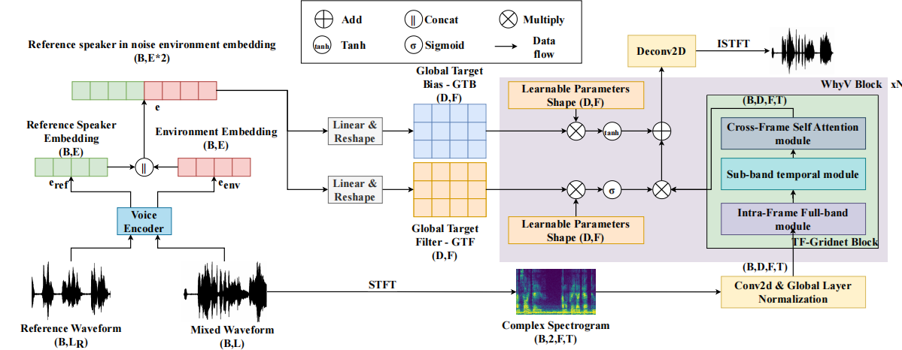

# Wanna Hear Your Voice: Adaptive, Effective, and Language-Agnostic Approach in Voice Extraction



## Introduction

**Wanna Hear Your Voice (WHYV)** is a novel, language-agnostic approach to Target Speaker Extraction (TSE) that adapts effectively across languages without the need for fine-tuning. This project addresses the challenge of transferring TSE models from one language to another while maintaining high performance.

The research focuses on modeling mixtures and reference speech, proposing a unique **gating mechanism** that modifies specific frequencies based on the speaker’s acoustic features. WHYV outperforms other models in adapting to different languages, achieving:

- **SI-SDR**: 17.3544 on clean English speech
- **SI-SDR**: 13.2032 on English speech mixed with Wham! noise

## Key Features

- **Language-Agnostic**: No fine-tuning required across languages.
- **Frequency Modulation**: Gating mechanism for adjusting specific frequencies.
- **High Performance**: Superior SI-SDR scores across languages and noise conditions.

## Demos

Explore the WHYV model in action through the following demos:

- **Vietnamese Conversation**: Hear the separation in Vietnamese speech.
- **Korean & English Mixed**: Experience language-agnostic separation with mixed languages.
- **English Mix (No Noise)**: High clarity in clean speech.
- **English Mix (With Noise)**: Extract the target speaker from noisy environments.
- **Multilanguage Mix**: Robust performance with multiple languages.

Visit the [Demo Page](https://hieugiaosu.github.io/WHYV_demo) for a full list of experiments and results.

## Citation

If you use the WHYV model in your research, please cite our preprint paper:

```bibtex
@article{thehieu2024whyv,
  title={Wanna Hear Your Voice: Adaptive, Effective, and Language-Agnostic Approach in Voice Extraction},
  author={The Hieu Pham and Tran Nguyen Phuong Thanh and Xuan Tho Nguyen and Tan Dat Nguyen and Duc Dung Nguyen},
  journal={arXiv preprint arXiv:2410.00527},
  year={2024},
  url={https://doi.org/10.48550/arXiv.2410.00527}
}
```

## Contact

HCMUT AITech Lab - [Website](https://ml4uhcmut.github.io/)
